# Название игры

- GravityBox runner

#Прообраз
Игра которая вдохнавила на создание ранера была замечена мной еще в далеком ~2005 году.
Называется игра NOM. Всего вышло две части этой игры. Создатели игры ([Gamevil Inc.](http://gamevil.com/))
позиционировали ее как развлекательную трешовую игру. Из [видео](http://www.youtube.com/watch?v=DLpX_tO37Nc)
можно понять что ни сюжета не смысла в действиях нет и цель одна продержаться как можно дольше.
Игровой процесс сопровождается яркими фоновыми цветами, это предает еще более раздражающий
эфект в игре. Также вышло еще несколько продолжений NOM 2: Free Runner [видео](http://www.youtube.com/watch?v=Vb4tQ8gOp08)
и NOM: Billion Year Timequest [видео](http://www.youtube.com/watch?v=eCprnmFib9c)

#Похожие игры

###Мобильная платформа
- Gravity gay [Видео](http://www.youtube.com/watch?v=40QrGmz15JA) Бесплатно Протой в управлении ранер, нужно только
вовремя тыкать в экран. Качественно прорисован, сюжет прост, убежать от преследователя.
- Gravity gay 2 [Видео](http://www.youtube.com/watch?v=0Tajnz9NxWM) Бесплатно Качественно сделаный ранер, сюжета
нет и игровой процес завязан на гринде. При зарабатывании монет можно купить скин который дает дополнительные баффы в игре.
- Gravity flip runner [Видео](http://www.youtube.com/watch?v=sSy4P3K0LHc) Бесплатно Сложное управление и
большое злоупотребление рекламой. После проигрыша в забеге нужно три раза отказаться от рекламы.
- Flip runner [Видео](http://www.youtube.com/watch?v=M9a3jjawoIk) 1$ Скучный однообразный геймплей,
игра не стоит доллара, она должна быть бесплатной.

###Персональный компьютер
- Electronic Super Joy [Видео](http://store.steampowered.com/video/244870) Клевое звуковое сопровождение, озвучка актеров
на чек поинтах. Музыка в стиле техно с беспределом творащимся на уровне где все кружится в разные стороны, деревья ростут
и распускаются, все везде шевелится и жители мира коментируют твои действия.
- And Yet It Moves [Видео](http://store.steampowered.com/video/18700) Игровой процесс построен на гравитации и прокручивании
мира. Главный герой находится в центре экрана и подвержен гравитации сверху вниз. Окружающий мир создан из обрывков бумаги.
Интересная механика которую хочется повторить в этом проекте.
- BIT.TRIP RUNNER [Видео](http://store.steampowered.com/video/63710)
- VVVVVV [Видео](http://store.steampowered.com/video/70300)
- Love [Видео](http://store.steampowered.com/video/269270)

#Целевая аудитория
- Поклонники раннеров
- Игроки на мобильных устройствах
- Поклонники игр в общественном транспорте с промежутком игровой сессии ~5 мин.
- Мужчины от 10 до 15 лет

#Визуальный стиль
Киберпанк, утопия, серые тона в повседневной жизни человека и яркие краски в творчестве и выражении себя перед обществом.

####Узнаваемые элементы
Картинка в стиле Леонардо Да Винчи, только там изображен киборг с заменеными частями тела на протезы.

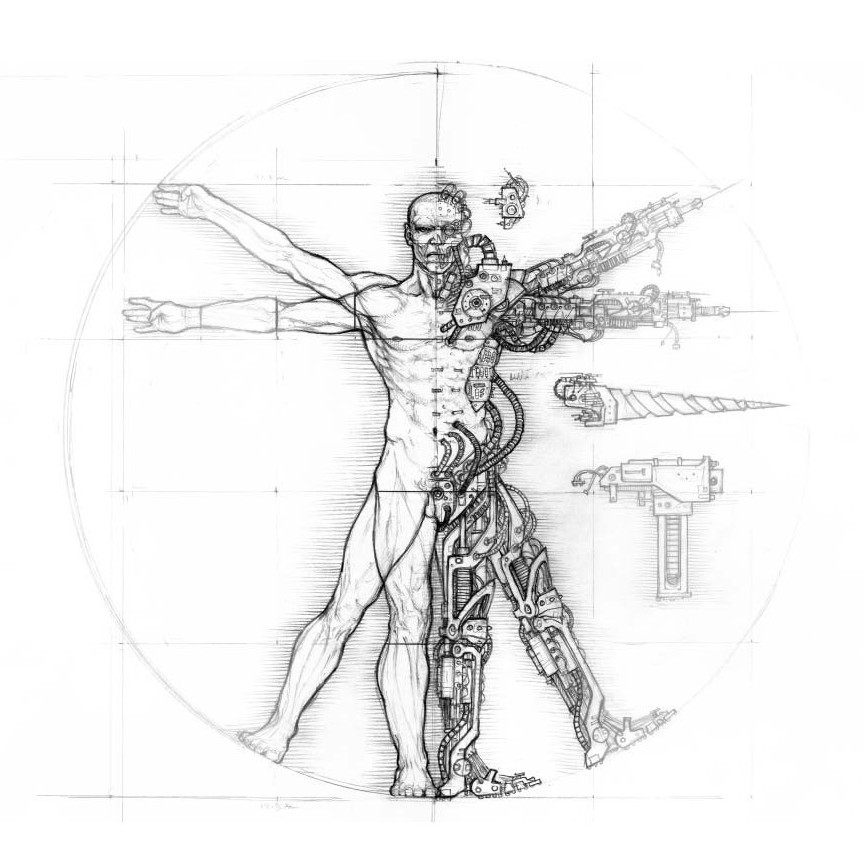

#Сценарий

###Жестокий спорт

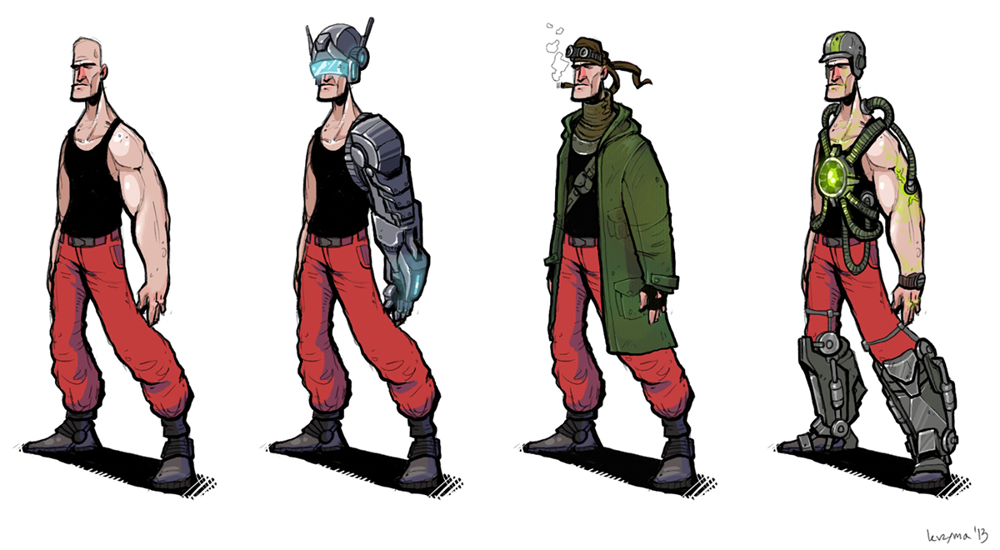

Будущее, в котором пропаганда мира и добра уже не работает. Только насилие и агрессия популярна в этом мире. После отмены
денег философия жизни изменилась и успех измерялся в достижениях перед обществом. Достижение могло быть в виде научной
деятельности или в развлекательной. На базе практически безлимитных доступов к ресурсам ученым удалось разработать вечный
двигатель и синтезатор продавольствия из переработаных материалов. Граници государств перестали существовать и все былые
конфликты стали козаться глупыми спорами из-за ресурсов. Для того чтобы удеражть контроль над населением планеты, правящий
класс предумывает матив для повышения социального статуса. Спорт стал для людей признаком лекой добычи уважения и славы.
Так как все блага человеческой рассы познавались до 20 лет люди теряли вкус к жизни и не ценили ни свою ни чужую жизнь.
Экзотические виды спорта, с практически полным уничтожением или изувечием учасника, бьют все рекорды по популярности.
Соревнования на ловкость и скорость между спортсменами в перемешку с ужасными переломами и страданиями.
В мегаполисе New Supernova проходят регулярные отборочные туры для желающих пройти в профессиональную лигу "True way".
Участников высшей лиги уважали и потакали любым капризам, но ходили слухи что у них из человеческого остался только мозг
да и то не у всех. Существовали и не официалные соревнования на которых работали тотализаторы и можно было заработать
дополнительных кредитов на жизнь и развлечения. Большим минусом таких соревнований было то, что в отличие от проффесиональных
соревнований, тут не было льгот для спортсменов. Так же практиковалось продажа и покупка спортсменов у других команд,
Крупные команды выкладывали круглые суммы за фаворитов, а команды, котрые продали удачно игрока форсируют свое продвижение за счет
средств вырученых со сделки.

###Майкер

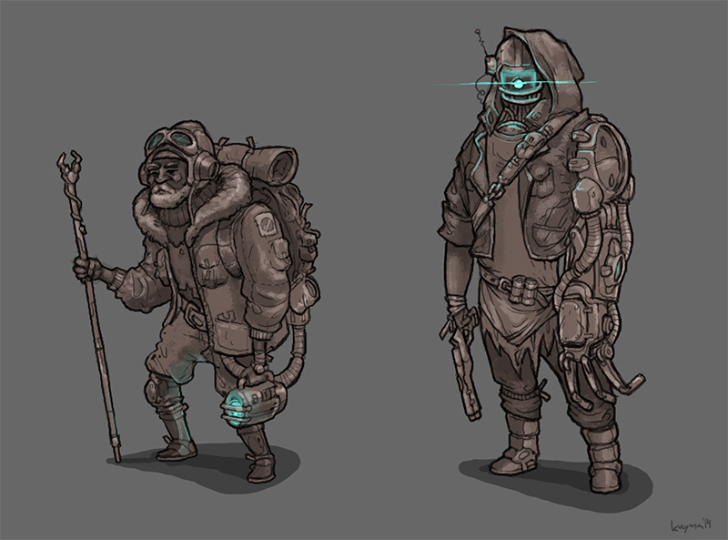

Молодой менеджер и по совместительству "Проводник" Майкер набирает кандидатов и начинает свой путь
с самой низкоуровневой касты неудачников. К нему приходят бездомные и наркоманы, которые гововы на всё
для получения членского значка или возможно, они просто сами не могут покончить с собой и идут в кандидаты, чтобы сократить
время своего никчемного существования. Выбрав из десятка пришедших семь кандидатов наиболее внушающих доверие. Майкер знал,
что в команду пройдут только пятеро, но получат медаль за участие все. Позвав первово претендента Майкер сел за штурвал и нажал
кнопку телепортатора. На экране терминала появилось тощее тело Сэма. Сэм был худым, сутулым, но так как его прошлая работа
была курьерской доставкой, он бегал достаточно быстро и ловко справлялся с тестовым заданием. Скорость реакции Сэма на
команды удивила Майкера и он даже вооброзил себе, что с таким бегуном сможет подняться до второй лиги и наконец, выбраться
из этой свалки наркоманов и бомжей. Радость длилась не долго, во время тестирования второго претендента произошло неприятное
происшествие. Джон вывихнул лодыжку и на регенерацию претендента прийдется потратить уйму времени. Растроеный последним тестом
Майкер по невнимательности подбросил Рэя перед препядствием "Тунель" и бедняга разбил голову об угол и скончался, не
добравшись до телепорта на финише. Опять прийдется тащить тело до телепорта и после утилизировать. Благо контракт
бегуна предусматривает летальные исходы на тренировке или даже на тестовом пробеге. Последняя тестовая пробежка вернула
Майкера с неба назад в трущебы. Рик был на столько не поворотлив, что было выгодней подождать пока восстановят ногу Джона,
чем мучаться с деревянным Риком. Вот и собралась очередная команда неудачников в первую лигу,для Майкер она была уже третьей
попыткой прорваться во вторую лигу. Команда состоит из спортсменов: Проводник Майкер, бегуны: Джон, Жан, Орэл, Боб, Сэм

###Начало карьеры

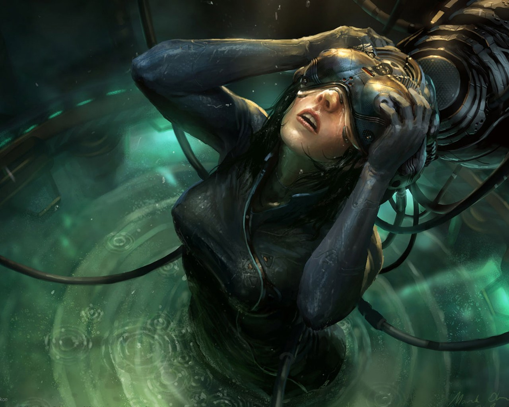

Каждый вечер перед сном Майкер думал об дне когда решил посветить свою карьеру спорту, а так как
страх высоты и не доверие к другим проводникам помогли Майкеру выбрать сторону "Проводника". В комнате, где проходили тренировки с
GravityBox'ами висел плакат с надписью "Бегун - лишь средство! Проводник не жалеет средств для победы!". GravityBox это
терминал для управления площадкой по которой перемещается бегун, проводник может перемещать в любом направлении полигон
и также вращать под любым углом, основная цель - как можно быстрей добраться бегуну до финишного телепорта, а проводник
всячески содействует этому. Обычное дело, когда бегун добирался до финиша с переломаной ногой или рукой из-за того, что
проводник решил сократить путь и подбросил бегуна слишком высоко, после чего его кости не выдерживали приземления с
большой высоты и ломались о твердый пол куба. Тренеры расказывали о том, что в высших лигах бегунам заменяют уязвимые
части тела на протезы. Это делает их забеги более зрелещными и длительными. В начальных лигах редко соревнуются на время
прихода к финишу. В таких забегах участвуют полностью органические люди и они попросту не доходят до финиша. Тогда считается
преодоленное расстояние и время за которое его преодолели плюс штраф за не пройденый путь.

###Подготовка к выступлению

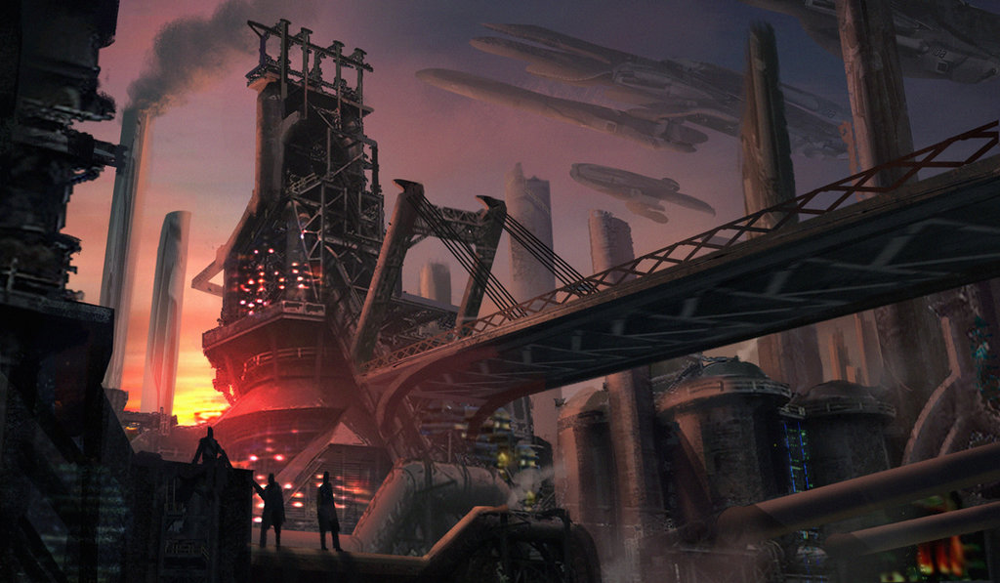

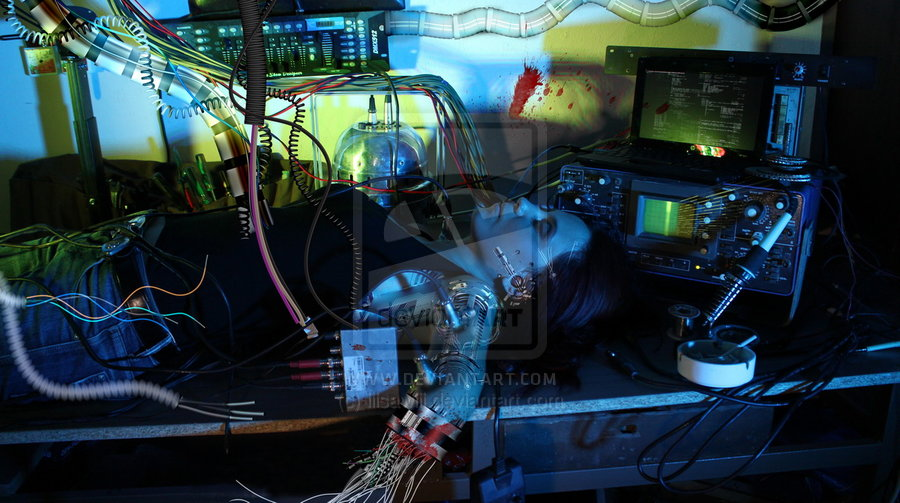

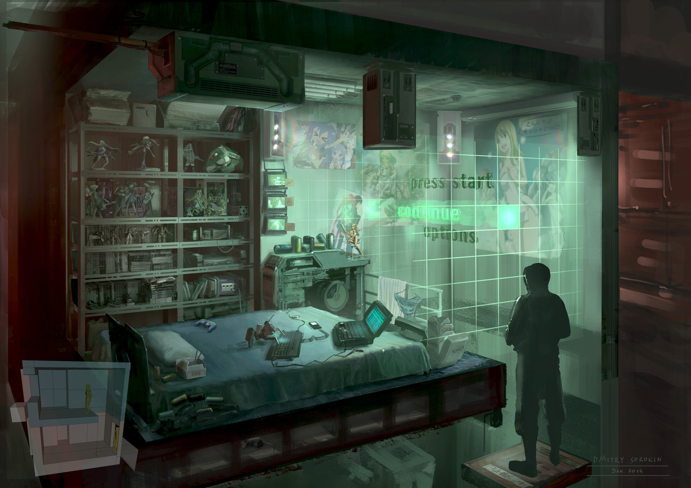

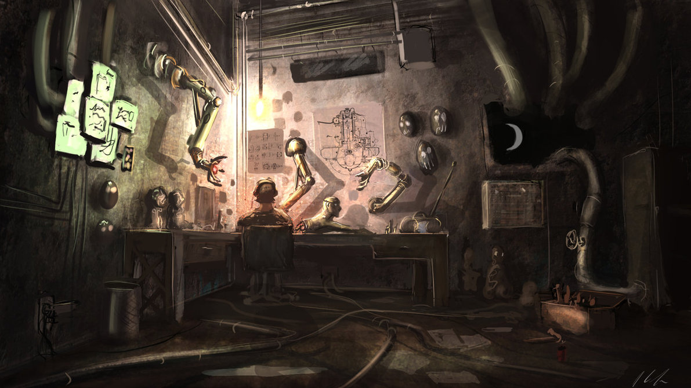

На следующий день Майкер в офисном ресурсном автомате получил свою ежедневную помощь спортсменам. Объем
которой высчитывался из количества участия в забегах прошлого дня и делился на уровень лиги в которой участвует твоя команда.
Дополнительно министерство здоровья и спорта выделяет разовую выплату за регистрацию нового учасника соревнований.
Для спортстменов в городе абсолютно бесплатная медицина. Майкер еще не обращался к киберхирургам за вживлением протезов,
не было с чем приходить. А капсулой регенерации пользовался регулярно и любил смотреть как быстрые клешни робота-реаниматора
восстанавливают ткани спортсмена. Спустя время пришло оповещение о том, что бегун Джон полностью реабилитирован и его можно забрать.
Забрав спортсмена из капсулы регенерации, команда отправилась на сертификацию. Сегодня еще одна квалификация на допуск к соревнованиям
и можно идти на турнир и сражаться за место во второй лиге. В зависимости от того, как твоя команда пройдет квалификацию,
комиссия по качеству забега сможет выдать инвертарь для форсированого продвижения команды по турнирной таблице, чтоб она
скорей добралась до подобающего соперника и показала захватывающую игру. Команда Майкера показала не плохой результат и
комиссия решила выдать два глайдера и три внеочередных визита в реабилитационный корпус. У Майкера были сбережения после
двух не удачных попыток и он,видя потенциал команды, решил купить один легкий ножной протез для Сэма. В хирургическом отделе,
заказав операцию по трансплонтации протеза, они ожидали своей очереди. Опереция по вживлению легкого протеза занимала три часа.
С новым протезом Сэм стал быстрее и может падать с большой высоты без особого вреда для здоровья. Этап подготовки завершен
завтра соревнования и команда Майкера готова к демонстрации своих способностей.

###Дебют

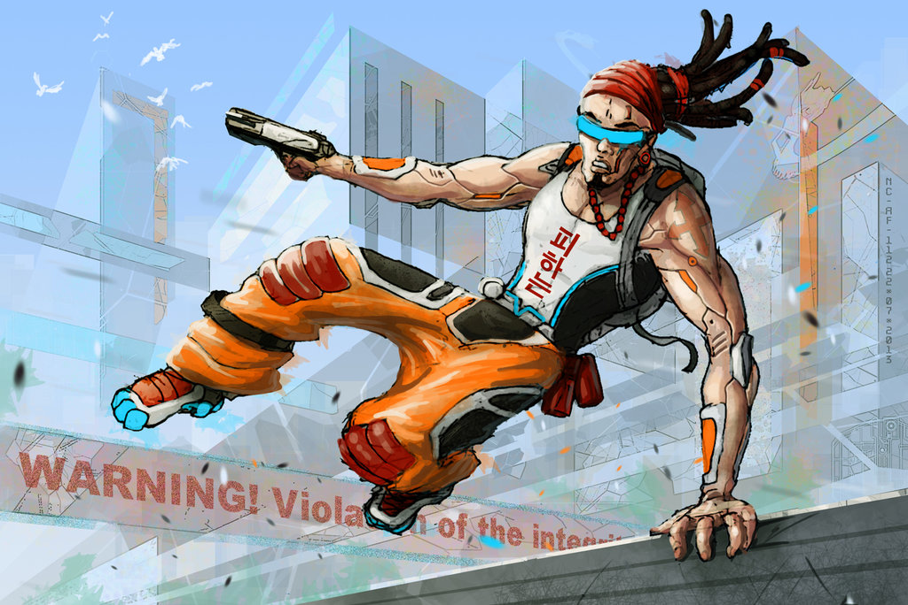

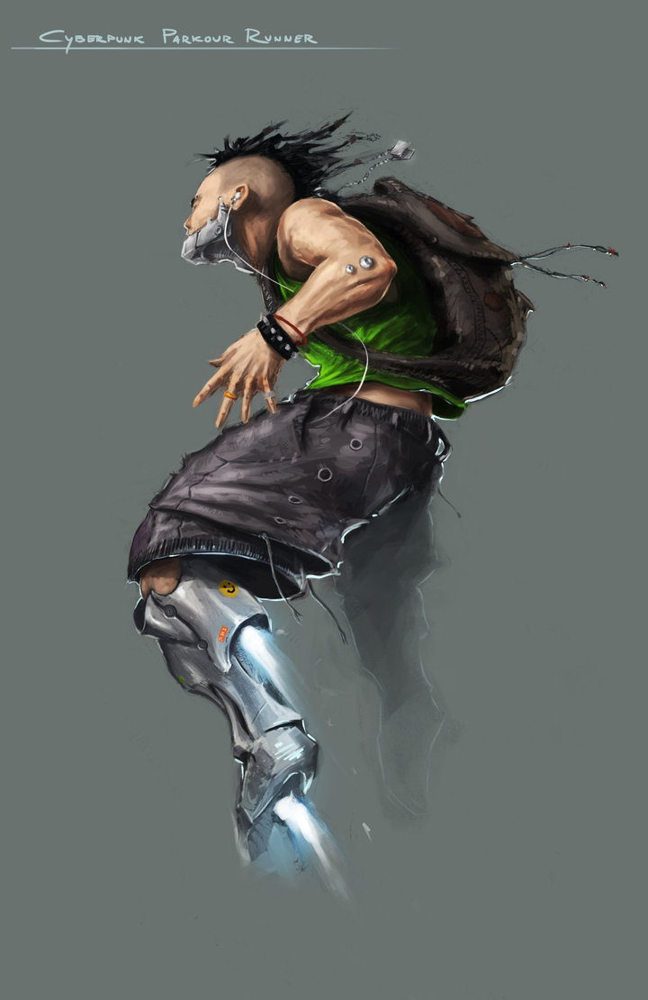

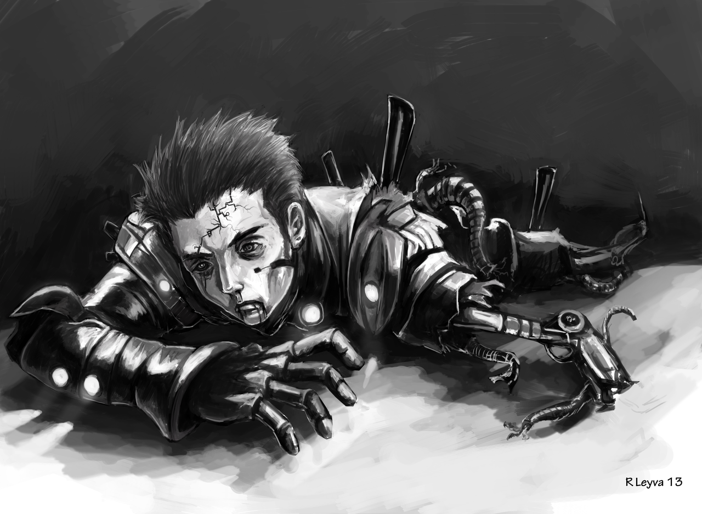

Настало время выступить Майкеру с его бегунами. Для начала необходимо разведать карту и послать более слабого бегуна, но с
достаточной выносливостью для того чтоб дойти до конца карты. Разведчик или разведчики, это зависит от результата
первого забега, сможет осмотреть карту и помочь Проводнику скоординировать последовательность действий для быстрого бегуна.
Майкер решил отправить Джона и Орэла в развед забег. Проводник был особено аккуратен и Бегун добрался до финиша всего с
парой синяков. В это же время выступала команда фаворит этих соревнований и её бегун показал приличный результат с первого
забега. Для забега Орэла был использован глайдер с помощью которого можно было иследовать глубокие провалы и искать сокращения
маршрутров. При спуске в длинную вертикальную шахту у Бегуна закончилось топливо в глайдере и его тело рухнуло на дно,
попутно переломав все конечносити и серьезно повредив глайдер, скорее всего вероятность починить будет очень мала.
Используя знания полученые при разведке, Бегуну удалось избежать несколько ловушек с шипами и сократить дорогу используя
платформы ускорения и гравитационные пушки. Повредив протез на маятнике с шипами, Джон все же добрался до финиша и показал
третий результат в общей группе на момент забега. Общий результат забегов будет виден после того, как все команды
пройдут карту и их очки засчитаются. В свободное время можно отправить спортсменов в реабилитацинные камеры или примерять
новые модификации для достижения лучших результатов, также можно выбрать новое оборудование в медицинский зал и установить
его для быстрого доступа к некоторым функциям без ожидания в очереди в бесплатной клинике. У команды Майкера было два
не задействованых спортсмена, он планировал использовать их в частных забегах, но передумал и оставил их для следующего тура.

###Вторая лига

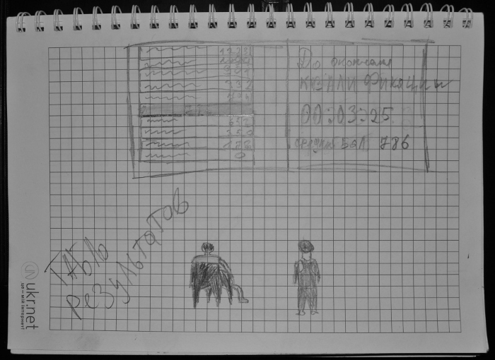

Майкер смотрел на табло результатов забегов. Во второй тур сможет перейти только половина команд у кого количество очков
превысит среднее значение и будет выше проходного бала. Пришло уведомление о том, что Орэл вернулся из реабилитационного
центра. На табло высветился результат последней команды. Очки команды Майкера были выше проходного минимума, но находились
на грани вылета, все зависило от результата последней команды, ее очки влияют на средний результат и если они окажутся на
20 пунктов выше, то Майкер останется на дне еще, как минимум, на один сезон. Последняя команда оказалась аутсайдерами, благодаря
её результатам, прошли квалификацию команды, которые находились ниже в рейтинге и до этого были в группе выбывших. В зависимости
от места в итоговой таблице начислялись бонусы и выдавался дополнительный инвентарь. Наконец Майкер прорвал череду неудач и теперь
перед ним стоят новые задачи. В профисиональном спорте доступно много новых опций для получения рэйтинга и соответствено кредитов.
Еженедельные соревнования на различных картах перед участием в финальных сражениях за переход в следующую лигу. Соревнования
между командами за получение титула лучшего бегуна Второй лиги, более уверенное участие в неофицальных забегах и игра
на татализаторе, все это ждет Майкера во Второй лиге, он не остановится и будет стремиться дойти до высшей касты до "True way".

#Персонажи

##Спортсмен

###Претендент

Обычно претендент выглядит чахлым и уставший от скучной жизни, но иногда встерчаюстся бывшие спортсмены из других областей
таких как легкая отлетика. Менеджеры всегда охотятся за такими учасниками, с ними легче работать так как они дисцеплинированны
и привыкле к тяжким испытаниям. Претендеты без протезов и имплонтантов, обычное человеческое тело с добавлением гаджетов для
использования средств комуникации. Встроиный спикер для связи и проэкция информации прямо на сечатку гляза для потребления
информации, иногда встречаются личности без глаз,а с интегрироваными инфракрасными сканерами, видимо необходимая деталь
для прошлого улвечения. Встретить киборга с протезированными конечностями в зале претендентов большая удача. Модернизация
у них не блещит последними научными разработками, но дает значительное преемущество.

###Стимулированный спортсмен

Использование допинга не воспрещается и по этому спортсменам дают стероиды для укрепления суставов, прочности костей и
увеличение выносливости. Стероиды дают побочный эффект в виде пегментации кожи в месте укола и ухудшения состояния внутренних
органов человека, увеличивается нагрузка на почки и белки в глазных яблоках желтеют. В редких случаях отмирали конечносли
или останавливалось сердце по среди забега, в таких случаях менеджеры нанимали новых спортсменов на замену выбывшему. Жизнь спротсмена сокращается до
нескольких спортивных сезонов, стероиды обходятся намного дешевле чем механические имплантанты. Обычно начинающие менеджеры
используют стероиды для быстрого старта своей команды жертвую спортсменами, это позволяет заработать больше успеха и
усовершенствовать других спортсменов с помощью кибернетических модификаций.

###Киборг

Спортсменов со стажем усовершенствуют с помощью механических имплантантов. Дешовые варианты ставятся поверх конечности
и служит усилениме её, но это оставляет хрупкость человеческого тела. Если спортсмен повредит конечность то иплант не
сможет помочь полноценно выполнять свои функции поколеченной части тела. Поверхностные импланты выглядят как балки в доль
костей и шарниры в области суставов. Закрепляются протезы с помощью магнитыный браслетов на местах соединения суставов и кости.
Более продвинутые протезы полностью заменяют конечность без возможности снятия его при жизни спортсмена. Такие протезы
выглядять как сплетение мышц без покрывающего из покрова кожи, переодически укрепленных из вставок пластын сверхпрочного
углепластика. Особо успешные заказывают гравировку на этих вставкак для украшения. Иногда встречаюстя узкоспециализированные
протезы, для придания большой прыгучести спортсмену или позволяющие цепляться практически за любую поверхность как паук
с помощью микро крючков или присосок для гладких или скользких материалов. Бывали случаи когда спортсмену заменяли внутренние
органы для того чтоб он мог преодолеть пределы человеческого организма и бежать быстрее, видеть дальше и слышать лучше. Очень
часто это делалось для того чтоб сберечь жизнь спортсмену после применения стимуляторов.

##Обслуживающий персонал

###Проводник

Обычно проводниками становились из-за психологических факторов, боязнь высоты или из-за суеверия что телепортация в игровое
пространство убивает тебя и лишь воссоздает твою копию. Встречались проводники которые были с садисткими наклонностями и
любили издеваться над бегунами, но таких каммисия вычисляла быстро и дисквалифицировала от спортивной деятельности.

##Генератор карт

Автоматическая генерация карты на базе четверостиший в стихах. Определенная комбинация букв означает то или иное препятствие.
Можно просто на базе текста, написать алгоритм который будет присваетвать определенные веса определенным препятствиям.

##Игровая сессия

###Менеджмент

У игрока в команде 5 персонажей которых он может может продавать или модифицировать, отправлять на ремонт/лечение.
Для продажи игрок вставляет на рынок выбранного бегуна за выбранную игроком цену. Для того чтобы продавать нужно покупать
аренду на торговой площадке. Аналогично можно пукупать спортсменнов. На содержание спортсменов нужно платить определенную
сумму в зависимости от звездного статуса спортсмена. Модификация при помощи стимуляторов или имплантов/протезов. 
Стимуляторы дают быстрый прирост силы на не продолжительный период времени, но после побочные эфекты которые ухудшают
характеристики на время ломки. Импланты дают не большой прирост, но не ухудшают другие показатели. Применение протезов
нельзя обратить и радикальные изенения ухудшают настроение персонажа.

###Соревнование

Игрок выбирает первого бегуна и начинает забег в сегодняшних соревнованиях. Если бегун не справляется с препятствием,
то новый спортсмен телепортируется на последний чекпоинт для продолжения соревнования. На пути преодаления лабиринта
игроку могут повстречаться такие препятсвия как шипы, ямы... На финише засчитывается время пробега и не добежавшие
спортсмены прибудут через две минуты со всем полученым ущербом во время забега.

---

#Термины

#####Дизайн документ (англ. Game Design Document)
это детальное описание разрабатываемой компьютерной игры. Диз. док. создается и редактируется командой разработчиков
и в основном используется в индустрии видеоигр для организации работы разработчиков. Документ создается в результате
сотрудничества между дизайнерами, художниками и программистами как руководство, которое используется в процессе
разработки. Когда издатель поручает создание игры разработчикам, команда разработчиков должна создать документ,
который часто связан с соглашением между издателем и разработчиком; разработчики должны придерживаться дизайн документа
во время процесса формирования игры.

---

#####Геймпле́й (англ. gameplay), гейм-плей
игровой процесс компьютерной игры с точки зрения игрока. Геймплей включает в себя разные аспекты
компьютерной игры, в том числе технические, такие как внутриигровая механика, совокупность определенных
методов взаимодействия игры с игроком и др. Само понятие геймплея крайне обобщено и обычно используется
для выражения полученных ощущений в ходе прохождения игры, под влиянием таких факторов, как графика,
звук и сюжет.

---

#####Акселеро́метр (лат. accelero — ускоряю и др.-греч. μετρέω «измеряю»
прибор, измеряющий проекцию кажущегося ускорения (разности между истинным ускорением объекта и гравитационным
ускорением). Как правило, акселерометр представляет собой чувствительную массу, закреплённую в упругом
подвесе. Отклонение массы от её первоначального положения при наличии кажущегося ускорения несёт информацию
о величине этого ускорения.
[Акселерометр на телефоне](http://www.youtube.com/watch?v=teJxjjBMTl4)

---

#####Атмосфера игры
cлабо определённое понятие, обычно употребляемое с указанием на эмоциональную вовлечённость участников в игру.
Чаще всего встречается упоминание об «атмосферной» (вызвавшей отклик, «зацепившей») игре, но этот же термин может
использоваться и в жалобах, что игра пресная, в ней «нет атмосферы». Так как эмоциональный отклик является едва ли
не необходимым условием вживания, то создание нужной атмосферы является признаком удачной игры с упором на этот компонент.

---

#####Сеттинг (от англ. setting — "обстановка", "помещение", "установка", "оправа")
среда, в которой происходит действие художественного произведения, настольной или компьютерной игры; место, время
и условия действия. Сеттинг можно определить как набор правил и внутренней истории некоего окружения. Так как данное
слово является заимствованным, его значение варьируется в зависимости от автора.
Словарь Мерриама-Вебстера определяет сеттинг как:

- время, место и обстоятельства, в которых развиваются события;
- время и место действия в литературном, драматическом или кинематографическом произведении;
- картонный задник в театральной или кинопостановке.

---

#####Стилизация
намеренная имитация художественного стиля, характерного для какого-либо автора, жанра, течения, для искусства и культуры
определенной социальной среды, народности, эпохи. Нередко связана с переосмыслением художественного содержания, составляющего
основу имитируемого стиля. В изобразительном искусстве и преимущественно в декоративном искусстве, дизайне - обобщение
изображаемых фигур и предметов с помощью условных приемов; особенно характерна для орнамента, где стилизация превращает
объект изображения в мотив узора.

---

#####Гринд
это необходимость очень долго повторять одно и тоже действие, чтобы получить чуть-чуть опыта/денег/вещей

---

#####Бафф (англ. buff)
термин в компьютерных играх, обозначает временное усиление игрока, как правило, под действием специального заклинания.
Срок баффа либо фиксирован, либо длится до его отмены игроком. Те или иные баффы существуют практически во всех MMORPG.
Способы их действия весьма различны, как между играми, так и внутри одной игры.

---

#####Крионика
(от греч. κρύος — холод, мороз) — сохранение в состоянии глубокого охлаждения («криоконсервация», «криосохранение»)
людей и животных в надежде на то, что в будущем их удастся оживить и при необходимости — вылечить.
Иногда криоконсервации подвергают только голову или головной мозг сохраняемого организма.
