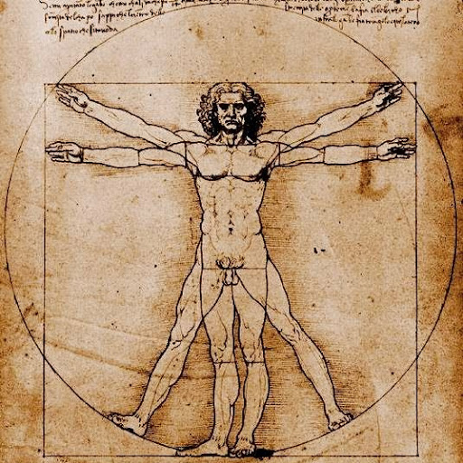

# Название игры

- GravityBox runner

#Прообраз
Игра которая вдохнавила на создание ранера была замечена мной еще в далеком ~2005 году.
Называется игра NOM. Всего вышло две части этой игры. Создатели игры ([Gamevil Inc.](http://gamevil.com/))
позиционировали ее как развлекательную трешовую игру. Из [видео](http://www.youtube.com/watch?v=DLpX_tO37Nc)
можно понять что ни сюжета не смысла в действиях нет и цель одна продержаться как можно дольше.
Игровой процесс сопровождается яркими фоновыми цветами, это предает еще более раздражающий
эфект в игре. Также вышло еще несколько продолжений NOM 2: Free Runner [видео](http://www.youtube.com/watch?v=Vb4tQ8gOp08)
и NOM: Billion Year Timequest [видео](http://www.youtube.com/watch?v=eCprnmFib9c)

#Похожие игры

###Мобильная платформа
- Gravity gay [Видео](http://www.youtube.com/watch?v=40QrGmz15JA) Бесплатно Протой в управлении ранер, нужно только
вовремя тыкать в экран. Качественно прорисован, сюжет прост, убежать от преследователя.
- Gravity gay 2 [Видео](http://www.youtube.com/watch?v=0Tajnz9NxWM) Бесплатно Качественно сделаный ранер, сюжета
нет и игровой процес завязан на гринде. При зарабатывании монет можно купить скин который дает дополнительные баффы в игре.
- Gravity flip runner [Видео](http://www.youtube.com/watch?v=sSy4P3K0LHc) Бесплатно Сложное управление и
большое злоупотребление рекламой. После проигрыша в забеге нужно три раза отказаться от рекламы.
- Flip runner [Видео](http://www.youtube.com/watch?v=M9a3jjawoIk) 1$ Скучный однообразный геймплей,
игра не стоит доллара, она должна быть бесплатной.

###Персональный компьютер
- Electronic Super Joy [Видео](http://store.steampowered.com/video/244870)
- And Yet It Moves [Видео](http://store.steampowered.com/video/18700)
- BIT.TRIP RUNNER [Видео](http://store.steampowered.com/video/63710)
- VVVVVV [Видео](http://store.steampowered.com/video/70300)
- Love [Видео](http://store.steampowered.com/video/269270)

#Целевая аудитория
- Поклонники раннеров
- Игроки на мобильных устройствах
- Поклонники игр в общественном транспорте с промежутком игровой сессии ~5 мин.
- Мужчины от 7 до 15 лет

#Визуальный стиль
Мой любимый стимпанк. Бронза, сюреализм, киборги.

####Узнаваемые элементы
Картинка в стиле Леонардо Да Винчи, только там изображен киборг с заменеными частями тела на протезы.

#Сценарий

Будущие, в котором пропаганда мира и добра уже не работает. Только насилие и агрессия популярна в этом мире.
Экзотические виды спорта с практически полным уничтожением или колеченьем учасника бьет все рекорды по популярности.
Соревнования на ловкость и скорость между спортсменами в перемешку с ужасными увечиями и страданиями.
В мегаполисе New Supernova проходят регулярные отборочные туры для желающих пройти в профессиональную лигу "True way".
Участников высшей лиги уважали и потакали любым капризам, но ходили слухи что у них из человеческого остался только мозг
да и то не у всех. Молодой менеджер и по совместительству "Проводник" Miker набирает кандидатов начинает свой путь
с самой низкоуровневой касты и плохих кандидатов. К нему приходять бездомные и наркоманы, которые гововы на все
для получения членской выплаты или возможно они просто сами не могут покончить с собой и идут в кандидаты.
Выбрав из десятка пришедших семь кандидатов наиболее внушающих доверие. Miker знал, что в команду пройдут только пятеро,
но получать первый взнос все. Позвав первово претендента Miker сел за штурвал и нажал кнопку телепортатора.
На экране терминала появилось тощее тело Сэма. Сэм был худым, сутулым, но так как его прошлая работа была курьерской
доставкой, то он бегал достаточно быстро и ловко справлялся с тестовым заданием. Скорость реакции Сэма на команды удивила
Mikera и он даже вооброзил себе что с таким бегуном сможет подняться до второй лиги и наконец выбраться из этой свалки
наркоманов и бомжей. Радасть длилась не долго, во время тестирования второго претиндента Джон вывихнул лодижку
и на регенерацию прендента прийдется потратить уйму времени. Растроеный последним тестом Miker по невнимательности
подбросил Рэя перед препядствием "Тунель" и бедняга разбил голову об угол и сканчался не добравшись до телепорта на финише.
Опять прийдется тащить тело до телепорта и после утилизировать. Благо контракт бегуна предуматривает летальные исходы
на тренировке или даже на тестовом пробеге. Рик был на столько не поворотлив, что было выгодней подождать пока
востановят ногу Джона, чем мучаться с Риком. Вот и собралась очередная команда неудачников в первую лигу,
для Mikera она была уже третьей.

Каждый вечер перед сном Miker об дне когда решил посветить свою жизнь спорту, а так как
страх высоты и не доверие другим проводникам Miker выбрал сторону "Проводника". В комнате где проходили тернировки с
GravityBox'ами висел плокат с надписью "Бегун лишь средство! Проводник не желеет средств для победы!". GravityBox это
терминал для управлением площадкой по которой перемещается бегун, проводник может перемещать в любом направлении полигон
и также вращать под любым углом, основная цель это как можно быстрей добраться бегуну до финишного телепорта, а проводник
всячески содействует этому. Обычное дело когда бегун добирался до финиша с переломаной ногой или рукой из-за того, что
проводник решил сократить путь и подбросил бегуна слишком высоко, после чего его кости не выдерживали приземления с
большой высоты и ломались о твердый пол куба. Тренеры расказывали о том, что в высших лигах бегунам заменяют уязвимые
части тела на протезы. Это делает их забеги более зрелещными и длительными. В начальных лигах редко соревнуются на время
прихода к финишу. В таких забегах участвуют полностью органические люди и они попросту не доходят до финиша. Тогда считается
преодоленое расстояние и время за которое его преодолели плюс штраф за не пройденый путь.

На следующий день Miker в офисном ресурсном автомате получил свою ежидневную помощь спортсменам. Объем
которой высчитывался из количества участия в забегах прошлого дня и делится на уровень лиги в которой участвует твоя команда.
Дополнительно министерство здоровья и спорта выделяет разовую выплату за регистрацию нового учасника соревнований.
Для спортстменов в городе апсолютно бесплатная медицина. Miker еще не обращался к кибер хирургам за вживление протезов,
небыло с чем приходить. Капсулой регенерации пользовался регулярно. Наконец забрал Джона из капсулы и команда отправилась
на сертификацию. Сегодня еще одна квалификация на допуск к соревнованиям и можно наконец идти на турнир. В зависимости
от того как твоя команда пройдет квалификацию, комиссия может выдать инвертарь для форсированого продвижения команды по
турнирной таблице, чтоб она скорей добралась до подобающего соперника и показали захватывающую игру. Команда Mikerа
показала не плохой результат и комисия выделела два глайдера и

to be continued...

#Термины

#####Дизайн документ (англ. Game Design Document)
это детальное описание разрабатываемой компьютерной игры. Диз. док. создается и редактируется командой разработчиков
и в основном используется в индустрии видеоигр для организации работы разработчиков. Документ создается в результате
сотрудничества между дизайнерами, художниками и программистами как руководство, которое используется в процессе
разработки. Когда издатель поручает создание игры разработчикам, команда разработчиков должна создать документ,
который часто связан с соглашением между издателем и разработчиком; разработчики должны придерживаться дизайн документа
во время процесса формирования игры.

---

#####Геймпле́й (англ. gameplay), гейм-плей
игровой процесс компьютерной игры с точки зрения игрока. Геймплей включает в себя разные аспекты
компьютерной игры, в том числе технические, такие как внутриигровая механика, совокупность определенных
методов взаимодействия игры с игроком и др. Само понятие геймплея крайне обобщено и обычно используется
для выражения полученных ощущений в ходе прохождения игры, под влиянием таких факторов, как графика,
звук и сюжет.

---

#####Акселеро́метр (лат. accelero — ускоряю и др.-греч. μετρέω «измеряю»
прибор, измеряющий проекцию кажущегося ускорения (разности между истинным ускорением объекта и гравитационным
ускорением). Как правило, акселерометр представляет собой чувствительную массу, закреплённую в упругом
подвесе. Отклонение массы от её первоначального положения при наличии кажущегося ускорения несёт информацию
о величине этого ускорения.
[Акселерометр на телефоне](http://www.youtube.com/watch?v=teJxjjBMTl4)

---

#####Атмосфера игры
cлабо определённое понятие, обычно употребляемое с указанием на эмоциональную вовлечённость участников в игру.
Чаще всего встречается упоминание об «атмосферной» (вызвавшей отклик, «зацепившей») игре, но этот же термин может
использоваться и в жалобах, что игра пресная, в ней «нет атмосферы». Так как эмоциональный отклик является едва ли
не необходимым условием вживания, то создание нужной атмосферы является признаком удачной игры с упором на этот компонент.

---

#####Сеттинг (от англ. setting — "обстановка", "помещение", "установка", "оправа")
среда, в которой происходит действие художественного произведения, настольной или компьютерной игры; место, время
и условия действия. Сеттинг можно определить как набор правил и внутренней истории некоего окружения. Так как данное
слово является заимствованным, его значение варьируется в зависимости от автора.
Словарь Мерриама-Вебстера определяет сеттинг как:

- время, место и обстоятельства, в которых развиваются события;
- время и место действия в литературном, драматическом или кинематографическом произведении;
- картонный задник в театральной или кинопостановке.

---

#####Стилизация
намеренная имитация художественного стиля, характерного для какого-либо автора, жанра, течения, для искусства и культуры
определенной социальной среды, народности, эпохи. Нередко связана с переосмыслением художественного содержания, составляющего
основу имитируемого стиля. В изобразительном искусстве и преимущественно в декоративном искусстве, дизайне - обобщение
изображаемых фигур и предметов с помощью условных приемов; особенно характерна для орнамента, где стилизация превращает
объект изображения в мотив узора.

---

#####Гринд
это необходимость очень долго повторять одно и тоже действие, чтобы получить чуть-чуть опыта/денег/вещей

---

#####Бафф (англ. buff)
термин в компьютерных играх, обозначает временное усиление игрока, как правило, под действием специального заклинания.
Срок баффа либо фиксирован, либо длится до его отмены игроком. Те или иные баффы существуют практически во всех MMORPG.
Способы их действия весьма различны, как между играми, так и внутри одной игры.

---

#####Крионика
(от греч. κρύος — холод, мороз) — сохранение в состоянии глубокого охлаждения («криоконсервация», «криосохранение»)
людей и животных в надежде на то, что в будущем их удастся оживить и при необходимости — вылечить.
Иногда криоконсервации подвергают только голову или головной мозг сохраняемого организма.
